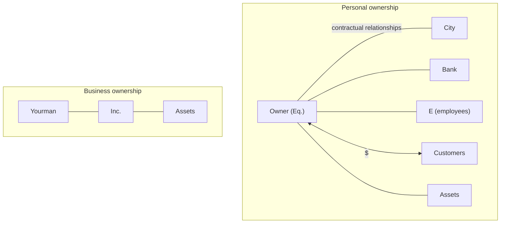

# BusOrg 1 — What is a Firm?

## Readings

- *no assigned reading*

## Notes

### Firm

- Firm: an entity with legal duties, obligations, and rights.
- Equity partners and owners are the main focus of the course.
- "Enterprise" or "business" is not a legal term.
- "Entity" is a legal term.

**Personal ownership vs. business ownership**



### Equity partner and bank

- Equity partner: entitled to the upside, but does not get a fixed amount at any time period.
- Bank: provides capital for money in the future (principal + interest).
- Debt is limited to the amount of assets the debtor has.
    - No concrete assets = likely have to raise equity against a debtor's idea .

### Who is part of the firm

- **Is someone or something part of the firm? The more someone has made a "durable investment" into the firm, the more they are part of the firm.**
- Equity partner > bank, in terms of being "part" of the entity.

### Entity

- Entity = the rules on opening the box and how to manage the box.
- Box = what the entity has.

**The box (schematic)**

```text
 ┌───┬───┬───┐
 │ $ │ $ │   │
 ├───┼───┼───┤
 │   │ $ │   │
 └───┴───┴───┘
   └─ contracts ─┘
```

- **Course focus:** equity investors and the "box" of the entity (BoD and officers).

Source photos: *BusOrg 01 p1.jpg*

## Signals

1. **Doctrine on the table:** What a firm and an entity are; equity partner versus bank as parts of the firm (durable investment).
2. **Hypo, and what he was fishing for:** Yourman holding assets personally versus through Inc. What he was fishing for: —
3. **Pushback on a student:** —
4. **What he called the hard case:** —
5. **What he said doesn't matter:** —
6. **Exam signal:** —
