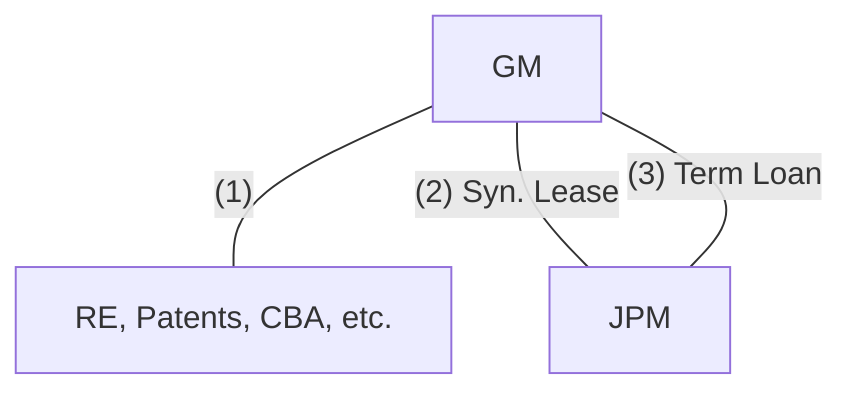

# BusOrg 2 — Perspectives on Agency

## Readings

- [[In re Motors Liquidation (2015)|In re Motors Liquidation]]
- [[Detroit Lions v. Argovitz (1984)|Detroit Lions v. Argovitz]]

## Notes

### Raising capital

- Raising capital = need for liability
    - owner shielding
    - Entity shielding
- **Main focus on corporations**

### Building blocks

1. Corporations
2. Partnership
3. Agencies

### Agencies

**Agency: external and internal perspectives**

```text
Principal ----------------- 3rd party   <- External relationship
    \
     Agent ~~~~ 3rd party
  ^
  Internal perspective
```

### External relationship

- principal → 3rd party; based on what agent does w/ principal
- Mandatory relationship

1. principal is liable for actions of the agent (Respondeat Superior)
    - → Can't contract out of principal liability for agent's actions
2. Agent can bind principal to contracts (obligation) and conveyances (property)
    - Actual authority - Principal has given / conveyed authority to agent
    - Apparent authority - principal has made the 3rd party believe the agent has authority to act on their behalf

- Barista giving away free coffee = actual authority of agent
- Agent authority - 3rd parties must know agent authority ex-ante to have a binding contract

### Internal relationship

- what agent owes to principal: fiduciary duties (Care and loyalty)
    - Care = anti-negligence
    - Loyalty = principal's interest
- Agency terminated on principal's choice
- Fiduciary duty → off the shelf but can be limited through indemnification [?]

### [[In re Motors Liquidation (2015)|In re Motors Liquidation]]

**GM financings with JPM**



1. Did JPM actually file the doc? How do we know? They "authorized" STB to file on their behalf.
    - But, what if JPM gave authority only to file the first two docs?
    - Authority is limited. But principal can't confine scope of authority too nebulous or ambiguous.
    - Generally, when a lawyer files something on your behalf, you are legally binded.

### [[Detroit Lions v. Argovitz (1984)|Detroit Lions v. Argovitz]]

**Lions, Sims, Gamblers**

```mermaid
flowchart LR
  A["Lions"] <-->|""| B["Sims"]
  B ---|""| C["Gamblers"]
  D["Argovitz"] ---|"IA"| B
  D --- C
```

- IA Argovitz
- → Breach of **duty of loyalty**

### Remedy

- Gamblers contract was ruled invalid.
- BUT, it was Argovitz who breached duty of loyalty, NOT the Gamblers themselves.
    - why not award Sims $$ from Argovitz?
    - Sims has to bear the burden of choosing Argovitz and giving him authority.
    - Normal rule: wrongdoer (agent) has to pay in breach of duty of loyalty/ca[re?] (fid. duty).
    - 3rd party typically gets the benefit of the bargain on agent.

Source photos: *BusOrg 02 p1.jpg*, *BusOrg 02 p2.jpg*, *BusOrg 02 p3.jpg*

## Signals

1. **Doctrine on the table:** Agency: external relationship (respondeat superior, actual and apparent authority) and internal relationship (fiduciary duties of care and loyalty); Motors Liquidation on authority; Argovitz on breach of duty of loyalty and remedy
2. **Hypo, and what he was fishing for:** —
3. **Pushback on a student:** —
4. **What he called the hard case:** —
5. **What he said doesn't matter:** —
6. **Exam signal:** —
