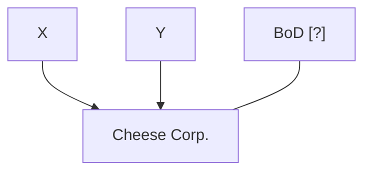

# BusOrg 3 — Incidents of Partnership and Incorporation

## Readings

- [[Meinhard v. Salmon (1928)|Meinhard v. Salmon]]
- [[Walkovzky v. Carlton (1966)|Walkovzky v. Carlton]]

## Notes

### GP

- Multiple people combined (similar to proprietorship w/ more people)

### GP - External

- Any partner can bind the GP
- Partners liable for partnership debts
- GPs assets liable for partners' debts
    - Assets of business at risk for individual debts
- One partner's debts **not** transferred to another partner's personal debt (just GP).

**GP: partners X and Y, and creditors reaching the GP**

```mermaid
flowchart TB
  X["X"] --> P["Cheese's partners"]
  Y["Y"] --> P
  P ---|""| B["Bank"]
  P ---|""| E["Employee"]
  P ---|""| V["Vendors"]
  C["Cap. [?]"]
```

- permeable (written beside the dashed boundary around Cheese's partners)

### GP - Internal

- Default rule: Equal sharing of profits and losses
    - Other partners can go after each other for contribution
- Fiduciary duty: Partners owe each other care and loyalty
- Dissolved at will or death
    - Any partner can force dissolution and, if needed, liquidation

### Holdout problems

- **As number of partners increase, the risk of holdout problems arise.**
- Any partner can create an impediment, holdout, etc.
    - poor partner = **equity worth more** because they don't need to contribute to GP's liabilities. (Moral Hazard)
    - Key: keep partnership small, limited, and finances of each partner **clear**.

### Corp. - External

- Shareholders can't bind companies; no managerial authority
- BoD appoint agents; oversee operations
- Shareholders: have ownership rights of Co. but not assets
- SH not liable for business debts ◁▷ Corp not liable for SH debts
- Leads to: Capital lock-in under Central Management

**Corp: shareholders X and Y, BoD**



- **very low cap. lock in**
    - opportunistic grabs (Holdouts, etc)
- **High cap. lock-in:**
    - Undisciplined, unaccountable BoD

**Cost of Equity against Capital Lock-in**

```text
Cost of
Equity
 |\            /|
 | \          / |
 |  \        /  |
 |   \______/   |
 +-- Capital Lock-in --
```

### Corp. (cont.) - Internal

- Fiduciary duties
- Charter restrictions

### [[Walkovzky v. Carlton (1966)|Walkovzky v. Carlton]] (1966)

- Why was Marchese an agent? Seon cab has respondeat superior for Marchese's actions.
- Wouldn't Marchese (cab driver) have a rental agreement renting the cab from Carlton create less liability for Carlton?
- Walkovzky sues (1) Carlton and (2) all other corporations along with Seon Cab Corp.
    - (1) is marked with the words "veil piercing" above it

1. Suing all other Corps: "Enterprise liability" → Courts should ignore formal law when all the corps. are "functioning" as one entity
    - **When corps. have the same shareholders, same purpose, same owners / types of assets**
    - **no true differentiation between the corporations. Only reason is to evade liability**
    - **Good reason for having different corps: provide different tranches of risk for different investors**
2. [[Limited liability - piercing the corporate veil|Veil piercing]]: Very hard to achieve with multiple shareholders.
    - Carlton is a good case for VP; but still didn't get it.
    - Normal rule: strict seperation

### Margin note

- Fix Notes creation format (include years)

Source photos: *BusOrg 03 p1.jpg*, *BusOrg 03 p2.jpg*

## Signals

1. **Doctrine on the table:** General partnership versus corporation (external and internal incidents); veil piercing and enterprise liability in Walkovzky v. Carlton
2. **Hypo, and what he was fishing for:** —
3. **Pushback on a student:** —
4. **What he called the hard case:** —
5. **What he said doesn't matter:** —
6. **Exam signal:** —
